# Keycloak Management App

## Introduction

Struggling with managing users in your Keycloak instance or deploying Keycloak on your OpenStack cloud environment? You're not alone. Many organizations face challenges in efficiently handling these tasks, especially when dealing with large numbers of users.

This Keycloak Management App is designed to streamline these processes, saving you time and effort. It provides a user-friendly web interface for two key functionalities:

- Mass User Insertion: Effortlessly add multiple users to your Keycloak instance at once. Simply upload a CSV file containing user information, and the app takes care of the rest.
- Seamless Keycloak Deployment on OpenStack: Deploy Keycloak on your OpenStack cloud environment with ease. The app guides you through configuring a Heat stack template to automate the deployment process.

## Target Audience

This app is ideal for organizations that use Keycloak for user management and authentication. It's particularly useful for administrators who need to manage large numbers of users or deploy Keycloak on OpenStack.

## Technologies

The Keycloak Management App is built using the following technologies:

- Next.js: A React framework for building web applications.
- TypeScript: A statically typed superset of JavaScript.
- Tailwind CSS: A utility-first CSS framework for quickly styling web applications.
- Keycloak Admin REST API: An API for managing Keycloak users and clients.
- Openstack Compute API: An API for managing OpenStack cloud resources.
- Openstack Networking API: An API for managing OpenStack networking resources.
- OpenStack Heat: An orchestration service for managing cloud resources.
- Docker: A platform for developing, shipping, and running applications in containers.

<div align="center">
	<code></code>
	<code></code>
	<code></code>
	<code></code>
	<code></code>
</div>

## Key Features:

### Mass User Insertion

The app allows you to upload a CSV file containing user information and add multiple users to your Keycloak instance at once. This feature is particularly useful for organizations that need to onboard large numbers of users quickly.

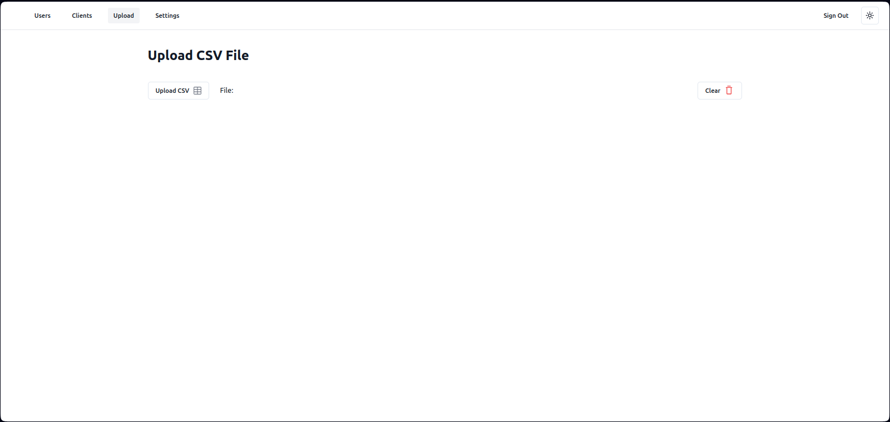

### Seamless Keycloak Deployment on OpenStack

Deploying Keycloak on OpenStack can be a complex process, involving multiple steps and configurations. The app simplifies this process by guiding you through configuring a Heat stack template to automate the deployment. This feature is ideal for organizations that want to deploy Keycloak on their OpenStack cloud environment.

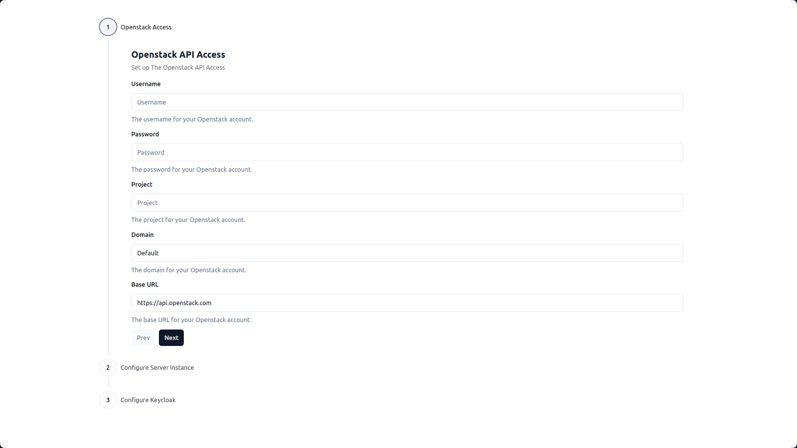

## Gettings Started

To get started with the Keycloak Management App, follow these steps:

1. Clone the repository:

```bash
git clone https://github.com/ZineddineBk09/Keycloak-Users-Management-App.git
```

2. Install the dependencies:

```bash
cd Keycloak-Users-Management-App
npm install
```

3. Run the app:

```bash
npm run dev
```

4. Open your browser and navigate to `http://localhost:3000` to access the app.

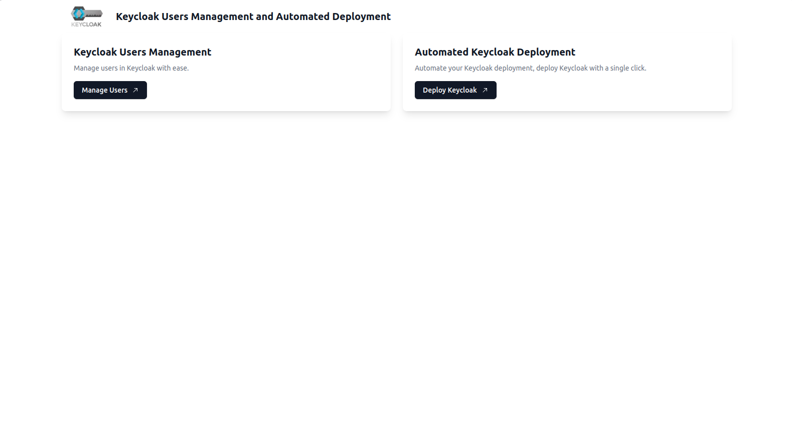

5. Mass User Insertion:

   1. Configure Keycloak client to allow the app to access the Keycloak Admin REST API.

      1. First, you need to create a client in Keycloak. To do this, click on the "Clients" tab in the app and then click on the "Create Client" button. Enter the client information and click "Save."

        <div align="center">        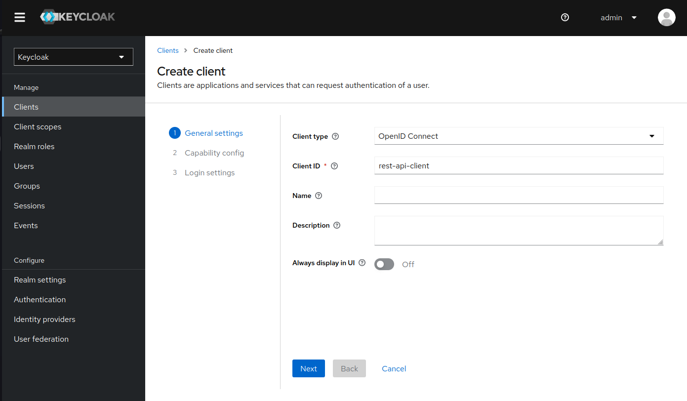        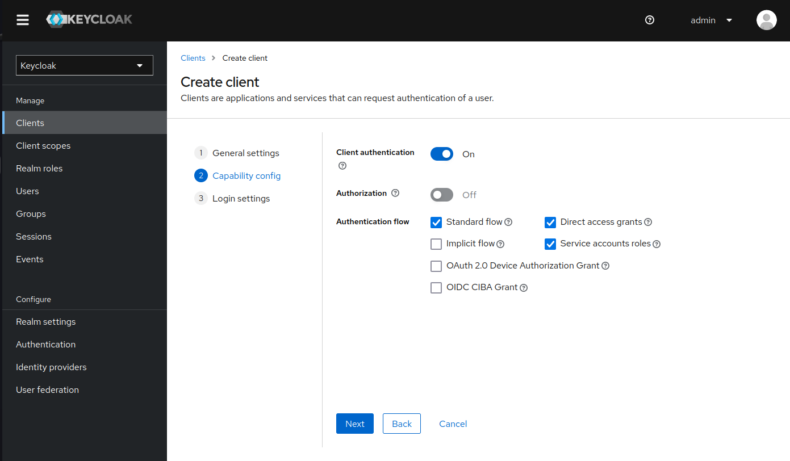        
      </div>

      2. Next, you need to configure the client with the appropriate roles and permissions. To do this, click on the "Services accounts roles" tab in the app and then click on the "Assign role" button. Change the filter to "Filter by clients" and select the roles (manage-users, view-users, query-users, manage-clients, view-clients, query-clients) you want to assign to the client.

      <div align="center">
        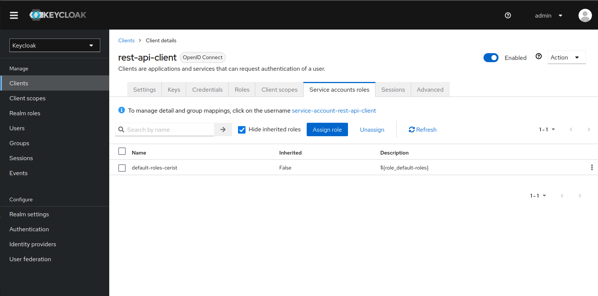
        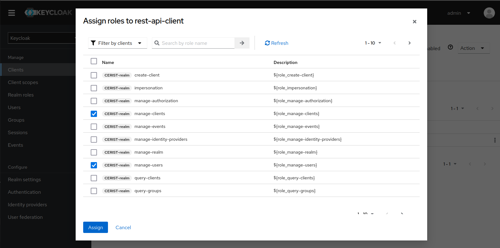
      </div>

   2. Register the client in the app: Go to the `/register` page and enter the client information (Client ID, Client Secret, Realm, Authentication Protocol, Keycloak Admin Username, Keycloak Server URL).

      

   3. Upload the CSV file: Go to the `/upload` page and upload a CSV file containing user information.

      > [!TIP]
      > You can use the file `MOCK_DATA.csv` provided in the repository as an example.

      

   4. The users `/users`, and clients `/clients` page both contains the list of users and clients respectively.

   <div align="center">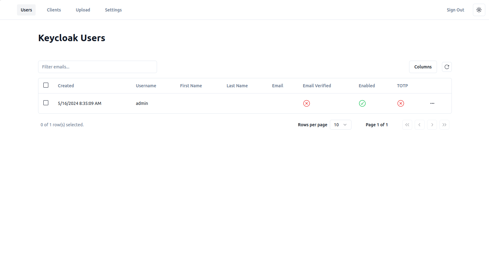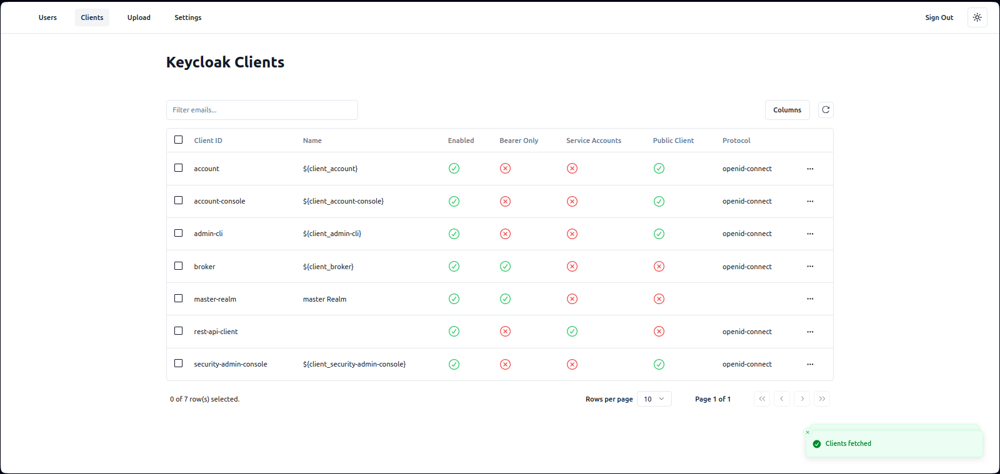</div>

   5. The `/settings` page allows you to change the settings entered in the registration page.

      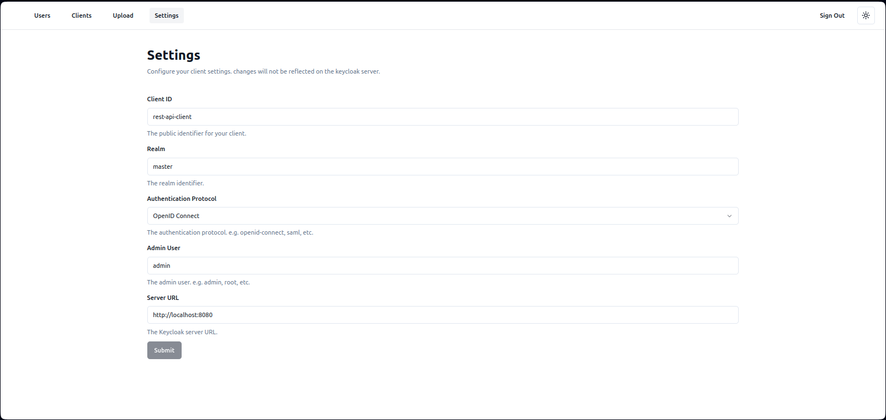

6. Seamless Keycloak Deployment on OpenStack:

   1. Configure OpenStack API access: Go to the `/start-deploy` page to check for the steps needed to configure the deployment.

      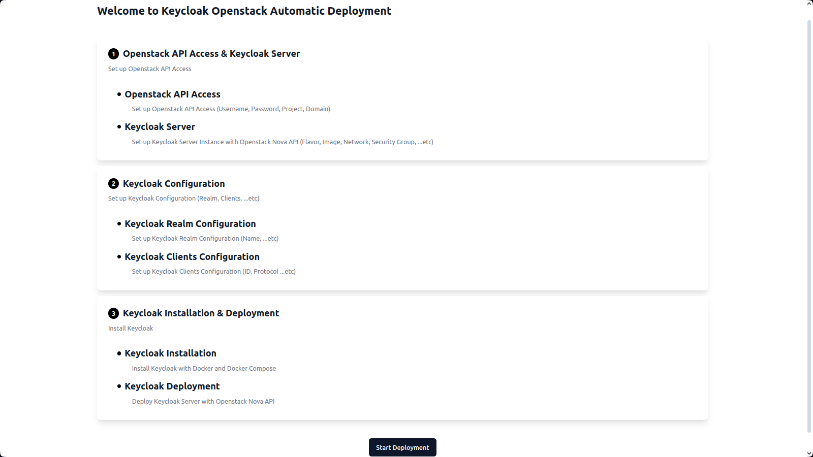

   2. Register the OpenStack API access in the app: Go to the `/deploy` page and enter the OpenStack API access information (OpenStack Username, OpenStack Password, OpenStack Project Name, OpenStack Domain, OpenStack Identity API Base URL).

      

   3. Configure the Keycloak server deployment: on the `2nd` step in the `/deploy` page and enter the Keycloak server deployment information (Keycloak Server Name, Keycloak Server Flavor, Keycloak Server Network Name, Keycloak Running Port, Keycloak Server Key Pair Name).

      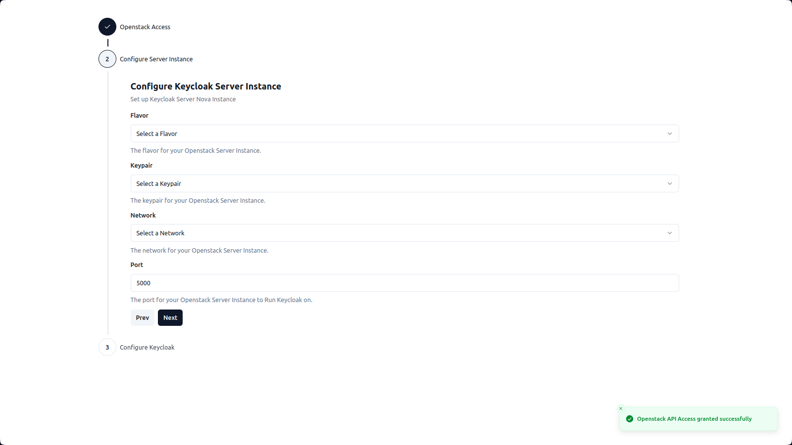

   4. Configure the Keycloak deployment: on the `3rd` step in the `/deploy` page and enter the Keycloak deployment information (Keycloak Realm, Keycloak Admin Username, Keycloak Admin Password).

      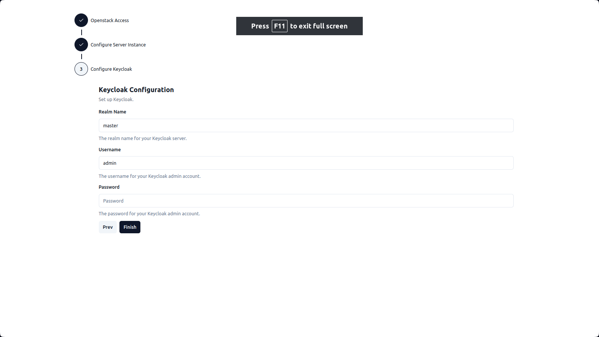

   5. Review the deployment: Finally, review the deployment information and click on the "Deploy" button to start the deployment process.

      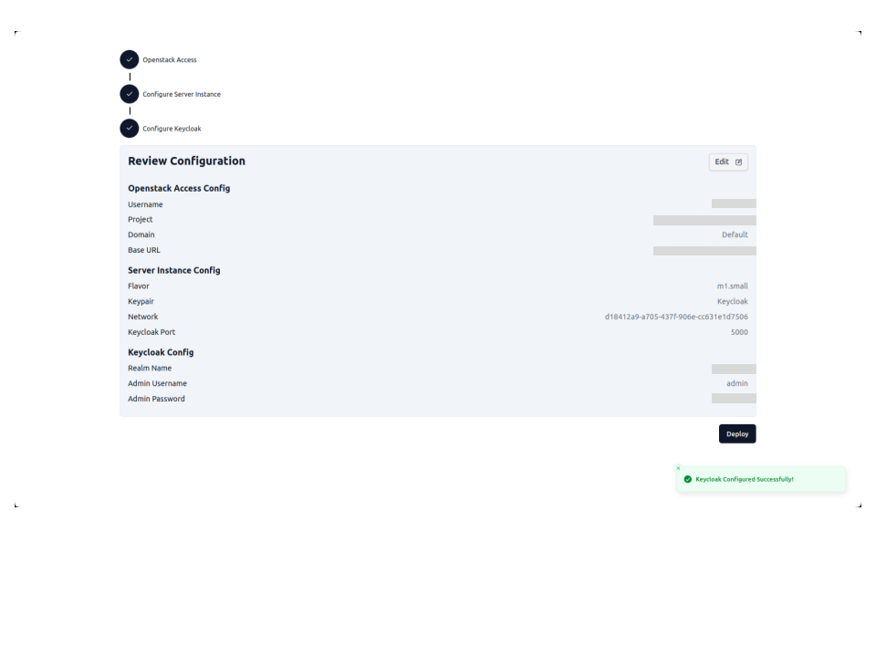

   6. Once the deployment starts, you can monitor the progress, and once it's completed, you can view the Keycloak server URL.

      <div align="center">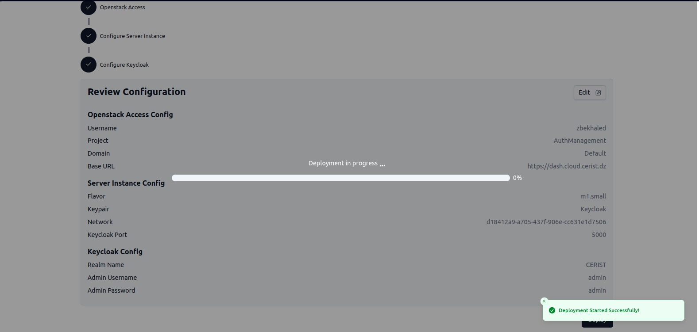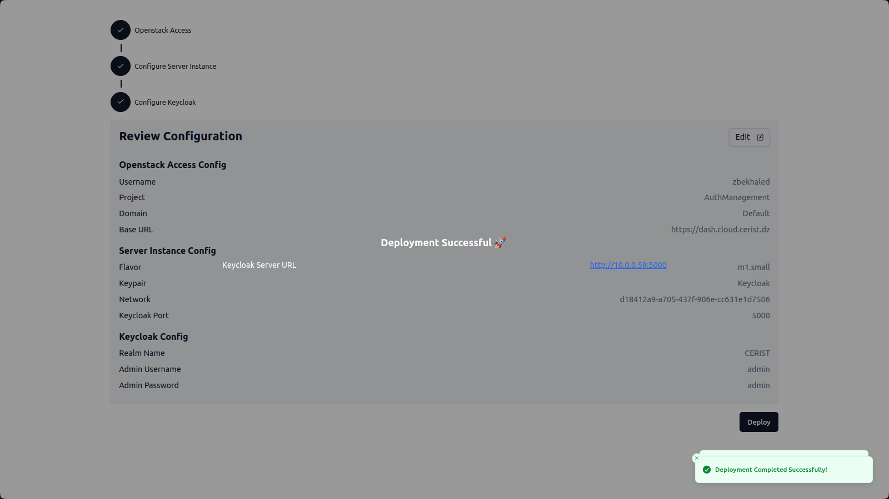</div>
