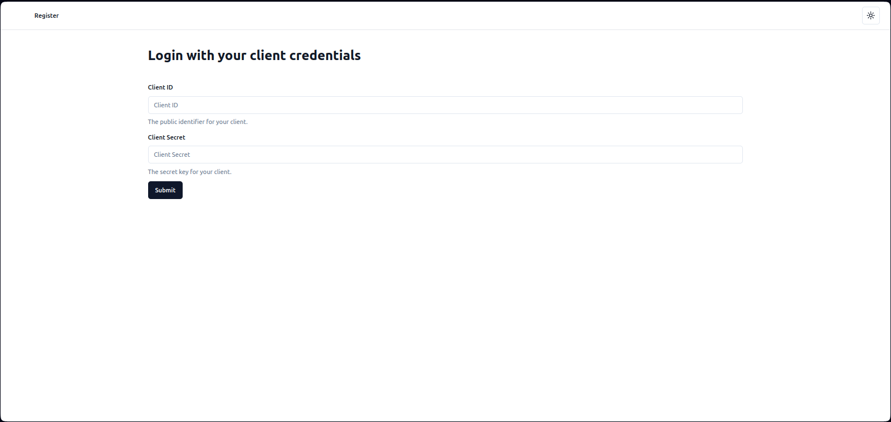
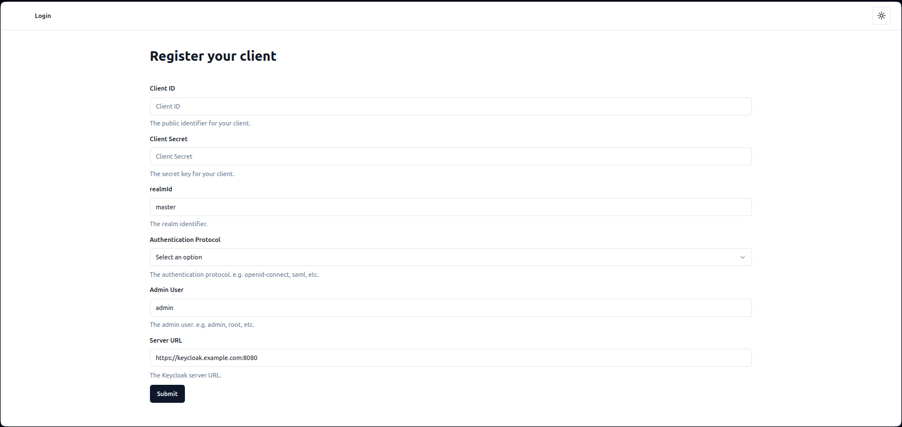
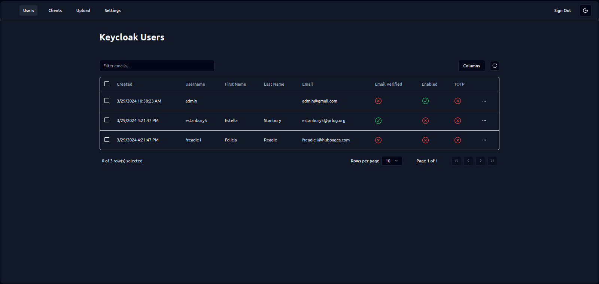

# Keycloak Users Manegement System

This is a simple project to manage users in a Keycloak server. It uses the Keycloak Admin REST API to manage users. the admin can leverage this system to mass create, update, and delete users through a simple interface and a csv file.

## Technologies

- Next.js
- React
- Tailwind CSS
- Keycloak Admin REST API
- Axios
- TypeScript

## Features

- List users
- Create user
- Create multiple users from a csv file
- Update user
- Delete user
- List clients
- Delete client

## Screenshots

### Client Login



### Client Registration



### Users


### Clients


### Upload Users (CSV)


### Settings


### Dark Mode



## Getting Started

**First**, run the keycloak server in a docker container in development mode:

```bash
docker run --name mykeycloak -p 8080:8080 \
                                        -e KEYCLOAK_ADMIN=admin -e KEYCLOAK_ADMIN_PASSWORD=admin \
                                        quay.io/keycloak/keycloak:latest \
                                        start-dev
```

and open [http://localhost:8080](http://localhost:8080) with your browser to see the keycloak server.

then, create a client in the keycloak server with the following settings:

- Client ID: `rest-api-client`
- Enable: `Client authentication`, and select the `Service accounts roles` options
- In Web Origins, add `http://localhost:3000` and `http://localhost:3000/*` to the list of allowed origins

After that, go to the client `Credentials` tab, copy the secret key, and paste it in the `.env.local` file in the root of the project:

```bash
NEXT_PUBLIC_KEYCLOAK_CLIENT_SECRET=YOUR_SECRET
```

Then go to `Service accounts roles` tab, and add the following roles:

- view-users
- manage-users
- query-users
- query-clients
- manage-clients
- view-clients

**Second**, run the development server:

```bash
npm run dev
# or
yarn dev
# or
pnpm dev
# or
bun dev
```

**Finally**, after running the development server, don't forget to commit the keycloak server container:

```bash
docker commit <container_id> keycloak-dev
```

then, when you are done, you can stop the keycloak server container:

```bash
docker stop <container_id>
```

and next time you can run the keycloak server with the following command:

```bash
docker run -p 8080:8080 keycloak-dev
```

Open [http://localhost:3000](http://localhost:3000) with your browser to see the result.

## Usage

1. Go to the `/register` page
2. Register a new keycloak client with the following settings:
   - Client ID: `rest-api-client`
   - Client Secret: `YOUR_SECRET`
   - Realm: `master` (default)
   - Authentication Protocol: `openid-connect` (default)
   - Keycloak Admin Username: `admin`
   - Keycloak Server URL: `http://localhost:8080`
3. Go to the `/` page and use the MOCK_DATA.csv file to upload users to the keycloak server
4. Go to the `/users` page to see the list of users
5. Go to the `/clients` page to see the list of clients
6. Go to the `/settings` page to change the settings entered in the registration page

## Keycloak REST API Documentation

[Keycloak REST API Documentation](https://www.keycloak.org/docs-api/21.0.0/rest-api/index.html)
